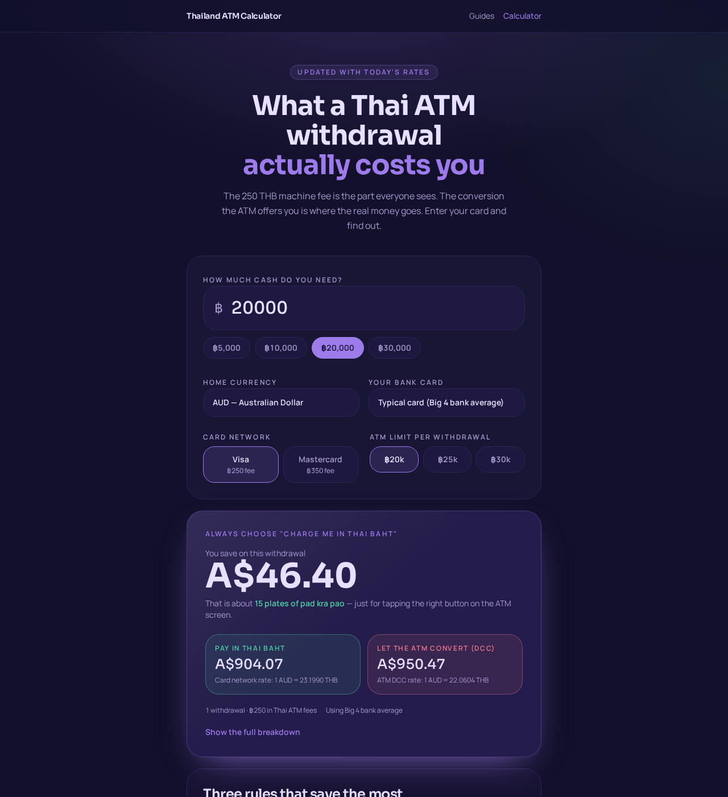

# Thailand ATM Fee Calculator

A free, no-sign-up calculator that shows what a foreign card actually costs at a Thai ATM — including the Thai machine fee, the ATM's sneaky "convert for me" screen, and your own bank's withdrawal fees.

**Live site:** [thailand-atm-calculator.com](https://www.thailand-atm-calculator.com)

## Why this exists

Thai ATMs quietly stack three charges on every withdrawal:

1. A flat machine fee — usually 250 THB on Visa, up to 350 THB on some Mastercard withdrawals.
2. A currency-conversion margin — your card network's rate is typically ~2.2% off the interbank rate; the ATM's "Dynamic Currency Conversion" screen is closer to ~7%.
3. Your own bank's fees — fixed withdrawal fees plus percentage fees plus foreign-transaction/FX markups.

The difference between "charge me in Thai baht" and "let the ATM convert" can easily hit 5–10% of the withdrawal. This calculator shows the real number for your specific card.

## How it works

- **102 cards** across 16 home currencies, each with fixed and percentage foreign-ATM fees, foreign-transaction fees, and extra FX markups.
- **Live THB rates** refreshed server-side and cached for 12 hours.
- **Multi-withdrawal splitting** when the amount exceeds the machine's per-transaction limit.
- **Two scenarios side by side**: "pay in THB" vs. "let the ATM convert".

Every card in the database carries a source URL and a last-verified date. The card-network and DCC margins are calibrated against a real bank transaction (CommBank, Feb 2026) rather than guessed.

## Data sources

Card fee data is compiled from official bank and issuer pricing pages — e.g. Wise, Revolut, Commonwealth Bank, ANZ, NAB, Westpac, Chase, HSBC, and others. Each card row stores:

- `source_url` — the page the fee was taken from
- `source_label` — a human-readable label for that page
- `last_verified_date` — when the fee was last checked
- `confidence_level` — high / medium / low
- `notes` — plan tiers, regional exceptions, free-withdrawal allowances, or other caveats

Margins are calibrated averages, not live quotes. The model does **not** yet account for monthly free-withdrawal allowances (e.g. Wise/Revolut give a couple of free ATM withdrawals per month), promotional waivers, or plan-tier changes.

## Tech stack

- [React 19](https://react.dev/) + [TanStack Start](https://tanstack.com/start) — full-stack, server-rendered for SEO
- [Tailwind CSS v4](https://tailwindcss.com/) — styling
- TypeScript throughout
- Deployed on [Vercel](https://vercel.com)

## How this was built

This started as a prototype built in Manus, then was rebuilt and redesigned in Lovable to improve performance, SEO, and mobile UX. Along the way I posted early versions on Reddit, gathered feedback, and iterated. For example, a user asked whether home-bank withdrawal fees were included in the total — they already were, but the breakdown wasn't visible enough. That led to clearer fee sourcing and a planned "what we include / don't include" note in the results.

The earlier prototype repo is archived at [thailand-atm-calc-archive](https://github.com/nikolalevanic-code/thailand-atm-calc-archive) (or whatever the old repo is renamed to).

## License

MIT — see [LICENSE](./LICENSE).
